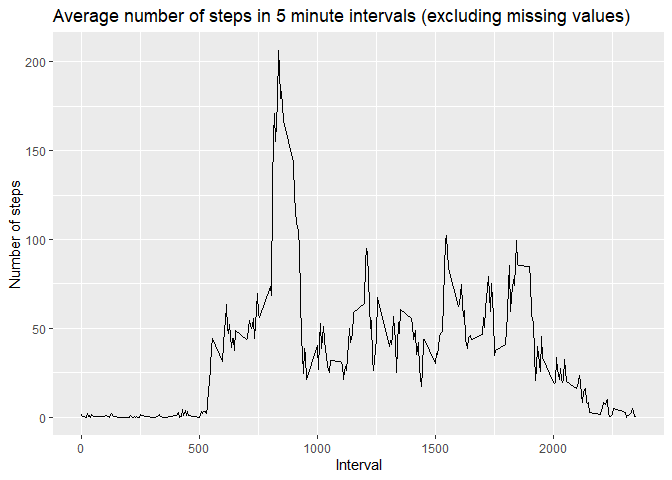
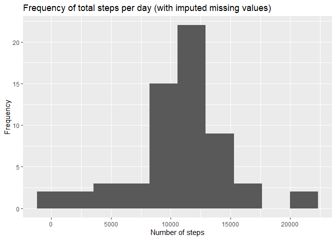
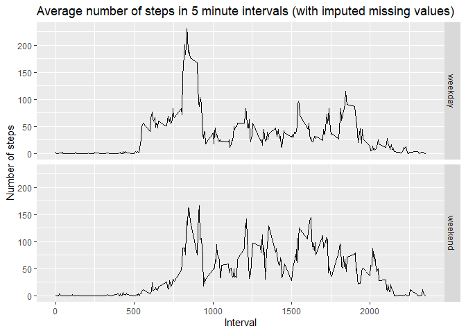

## Loading and preprocessing the data

The following code chunk loads the required R packages "ggplot2" and "dplyr", and also reads in the data file.


```r
library(ggplot2)
library(dplyr)
```

```
## 
## Attaching package: 'dplyr'
```

```
## The following objects are masked from 'package:stats':
## 
##     filter, lag
```

```
## The following objects are masked from 'package:base':
## 
##     intersect, setdiff, setequal, union
```

```r
data <- read.csv("activity.csv", header = TRUE)
```

## What is mean total number of steps taken per day?

The following code chunk calculates and plots a histogram of the total number of steps taken each day.


```r
data1 <- data %>%
        group_by(date) %>%
        summarise(steps_total = sum(steps))
ggplot(data1, aes(steps_total)) + geom_histogram(bins = 10) + labs(x = "Number of steps", y = "Frequency", title = "Frequency of total steps per day (excluding missing values)")
```

```
## Warning: Removed 8 rows containing non-finite values (stat_bin).
```

<!-- -->

The mean and median of the total number of steps taken per day are as follows.


```r
mean(data1$steps_total, na.rm = TRUE)
```

```
## [1] 10766.19
```

```r
median(data1$steps_total, na.rm = TRUE)
```

```
## [1] 10765
```

## What is the average daily activity pattern?

The following code chunk plots a time series graph of the 5-minute interval and the average enumber of steps taken, averaged across all days.


```r
data2 <- data %>%
        group_by(interval) %>%
        summarise(steps_avg = mean(steps, na.rm = TRUE))
ggplot(data2, aes(interval, steps_avg)) + geom_line() + labs(x = "Interval", y = "Number of steps", title = "Average number of steps in 5 minute intervals (excluding missing values)")
```

<!-- -->

The 5-minute interval which contains the maximum number of steps, averaged across all the days in the dataset is as follows.


```r
data2$interval[which.max(data2$steps_avg)]
```

```
## [1] 835
```

## Imputing missing values

The total number of missing values in the dataset is as follows.


```r
sum(is.na(data$steps))
```

```
## [1] 2304
```

The following code chunk creates a new dataset that is equal to the original dataset but with the missing data filled in, then plots a histogram of the total number of steps taken each day. Missing values were imputed by using the mean for that 5-minute interval.


```r
data_imputed <- data %>%
        group_by(interval) %>%
        mutate(steps = ifelse(is.na(steps), mean(steps, na.rm = TRUE), steps)) %>%
        arrange(date)
data3 <- data_imputed %>%
        group_by(date) %>%
        summarise(steps_total = sum(steps))
ggplot(data3, aes(steps_total)) + geom_histogram(bins = 10) + labs(x = "Number of steps", y = "Frequency", title = "Frequency of total steps per day (with imputed missing values)")
```

<!-- -->

The mean and median of the total number of steps taken per day after imputing the missing values are as follows.


```r
mean(data3$steps_total)
```

```
## [1] 10766.19
```

```r
median(data3$steps_total)
```

```
## [1] 10766.19
```

## Are there differences in activity patterns between weekdays and weekends?

The following code chunk adds a factor variable to the imputed dataset indicating whether the date is a "weekday" or "weekend", then makes a panel plot containing a time series graph of the 5-minute interval and the average number of steps taken, averaged across all weekday days or weekend days.


```r
day <- gsub("^S(.*)day", "weekend", weekdays(as.Date(data3$date)))
day <- as.factor(gsub("(.*)day", "weekday", day))
data_imputed <- data_imputed %>%
        mutate(day_type = day)
data4 <- data_imputed %>%
        group_by(day_type, interval) %>%
        summarise(steps_avg = mean(steps))
ggplot(data4, aes(interval, steps_avg)) + geom_line() + facet_grid(day_type ~ .) + labs(x = "Interval", y = "Number of steps", title = "Average number of steps in 5 minute intervals (with imputed missing values)")
```

<!-- -->
