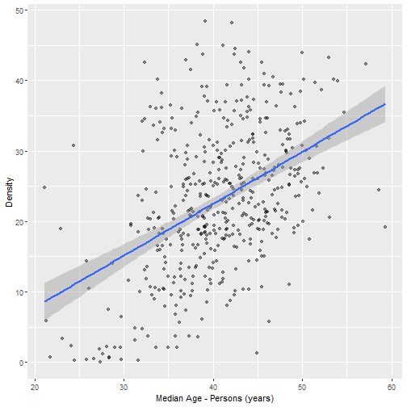

<style>
.small-code pre code {
  font-size: 0.7em;
}
</style>

Interactive app for exploring solar installation data in Australia
========================================================
author: Anthony Liu
date: 28 February 2020
autosize: true

Premise of app
========================================================

This app aims to give the user the ability to quickly visualise and perform simple linear regressions using different predictors and responses. This app combines data from the Australian Photovoltaic Institute and Australian Bureau of Statistics to explore the relationship between solar installations and demographics of different local government areas (LGAs) in Australia.

Along with an interactive plot, the app also outputs summary statistics for the linear model $$response = \beta_0 + \beta_1 \times predictor + \epsilon$$ where the response and predictor are variables chosen by the user. The purpose of this app is to allow quick analysis of different solar installation and demographic metrics.

Preview of analysis in app
========================================================
class: small-code



***


```

Call:
lm(formula = Density ~ `Median Age - Persons (years)`, data = data)

Residuals:
     Min       1Q   Median       3Q      Max 
-24.8255  -6.4359  -0.9104   5.8594  26.5424 

Coefficients:
                               Estimate Std. Error t value Pr(>|t|)    
(Intercept)                    -6.91413    2.73951  -2.524   0.0119 *  
`Median Age - Persons (years)`  0.73585    0.06659  11.050   <2e-16 ***
---
Signif. codes:  0 '***' 0.001 '**' 0.01 '*' 0.05 '.' 0.1 ' ' 1

Residual standard error: 9.108 on 477 degrees of freedom
Multiple R-squared:  0.2038,	Adjusted R-squared:  0.2021 
F-statistic: 122.1 on 1 and 477 DF,  p-value: < 2.2e-16
```

Available predictors and responses for analysis
========================================================

**Predictors**:

- Density
- Installations
- Capacity
<br/><br/>

**For more information:**

See the app documentation.

***

**Responses**:

- IRSAD socioeconomic index
- Median age
- Population density
- Total born overseas
- Bachelor degree
- Completed Year 12 or equivalent

References / Data
========================================================

- Australian PV Institute (APVI) Solar Map, funded by the Australian Renewable Energy Agency, accessed from pv-map.apvi.org.au on 19 February 2020. Dataset can be downloaded fromhttps://pv-map.apvi.org.au/historical#4/-26.67/134.12
- Australian Bureau of Statistics 2020, 'Regional Statistics by LGA 2018, 2011-2018', viewed 26 February 2020, http://stat.data.abs.gov.au.
